# BAGIAN A

## Return on Assets (ROA)
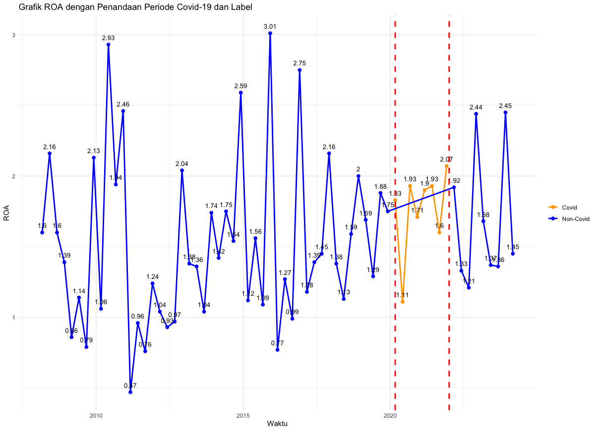

[1] Bagaimana kondisi Perusahaan sejak terjadinya pandemi Covid-19
``` 
    Sejak dimulainya pandemi Covid-19 pada Q1-2020, perusahaan mengalami tantangan signifikan yang tercermin pada rasio Return on Assets (ROA). Pada awal pandemi, ROA perusahaan mengalami penurunan tajam dari 1.83 menjadi 1.11, menunjukkan dampak negatif langsung terhadap kemampuan perusahaan dalam menghasilkan laba dari aset yang dimilikinya. Penurunan ini kemungkinan besar disebabkan oleh gangguan operasional, tekanan ekonomi global, dan perubahan permintaan pasar akibat situasi pandemi yang tidak terduga.

    Namun, setelah periode awal yang sulit, perusahaan menunjukkan kemampuan adaptasi yang cukup baik. Dalam beberapa kuartal berikutnya, ROA kembali meningkat secara bertahap hingga mencapai 1.93, mencerminkan adanya upaya pemulihan melalui pengendalian biaya, efisiensi operasional, atau mungkin diversifikasi pendapatan. Perusahaan mampu mengatasi tantangan yang muncul dan mulai menstabilkan kinerjanya.

    Memasuki periode selanjutnya, meskipun pandemi masih berlangsung, ROA perusahaan cenderung stabil dengan nilai berkisar antara 1.6 hingga 2.07. Stabilitas ini mengindikasikan bahwa perusahaan telah menemukan cara untuk menjaga efisiensi operasional dan tetap kompetitif meskipun kondisi ekonomi global belum sepenuhnya pulih.

    Secara keseluruhan, meskipun pandemi memberikan dampak awal yang cukup berat, perusahaan menunjukkan resiliensi yang kuat. Kemampuan untuk beradaptasi, mempertahankan efisiensi, dan memitigasi risiko lebih lanjut menjadi kunci dalam menjaga stabilitas kinerja keuangan selama periode yang penuh tantangan ini. Hal ini mencerminkan manajemen yang responsif dan strategi yang efektif dalam menghadapi situasi yang tidak menentu. 
```
[2] Apakah ada perbedaan kondisi Perusahaan sejak terjadinya Covid-19 (pertanyaan 1) dibandingkan dengan sebelum terjadi Covid-19 berdasarkan rasio keuangan
```
    Berdasarkan grafik Return on Assets (ROA), terdapat perbedaan signifikan antara kondisi perusahaan sebelum, selama, dan setelah pandemi Covid-19.

Kondisi Sebelum Covid-19:
    Pada periode sebelum pandemi, nilai ROA perusahaan cenderung fluktuatif dengan pola yang tidak stabil. Nilai ROA bergerak dalam rentang yang cukup lebar, dari angka serendah 0.77 hingga mencapai puncaknya di 3.01. Fluktuasi ini mencerminkan dinamika efisiensi perusahaan dalam menggunakan asetnya untuk menghasilkan laba. Periode ini menunjukkan adanya tantangan yang beragam bagi perusahaan, seperti perubahan efisiensi operasional, kondisi pasar yang dinamis, atau pengaruh eksternal lainnya.

    Namun, secara umum, sebelum Covid-19, perusahaan tidak menunjukkan tren kenaikan atau penurunan yang konsisten. Stabilitas jangka panjang sulit dicapai, meskipun ada beberapa periode dengan peningkatan signifikan. Hal ini menunjukkan bahwa efisiensi penggunaan aset cenderung terganggu oleh berbagai faktor, baik internal maupun eksternal.

Kondisi Selama Covid-19:
    Ketika pandemi dimulai pada Q1-2020, perusahaan mengalami penurunan signifikan pada ROA, dari 1.83 ke 1.11. Penurunan ini mencerminkan dampak langsung pandemi terhadap efisiensi operasional dan profitabilitas perusahaan. Namun, setelah dampak awal tersebut, perusahaan mulai menunjukkan tanda-tanda pemulihan. ROA meningkat secara bertahap dan kembali mencapai angka 1.93 pada akhir periode pandemi.

    Pemulihan ini mengindikasikan kemampuan perusahaan untuk beradaptasi dengan kondisi pandemi. Strategi pengelolaan yang lebih efisien, seperti pengurangan biaya, optimalisasi operasional, atau langkah strategis lainnya, kemungkinan berkontribusi pada pemulihan tersebut. Stabilitas yang dicapai selama pandemi menunjukkan bahwa meskipun perusahaan menghadapi tantangan besar, mereka mampu mengatasi dampak buruknya dengan cepat.
```

## Return on Equity (ROE)
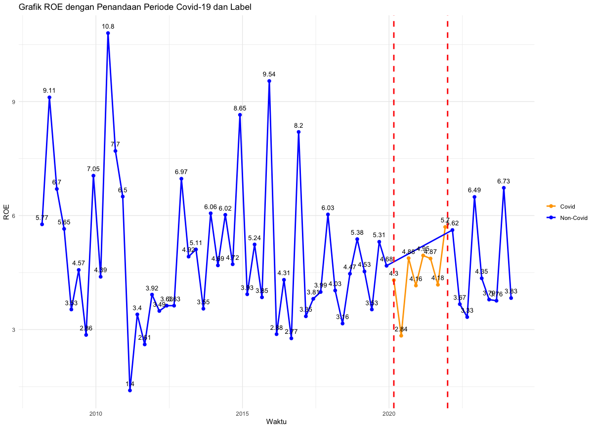
[1] Bagaimana kondisi Perusahaan sejak terjadinya pandemi Covid-19
```
    Sejak dimulainya pandemi Covid-19 pada Q1-2020, kinerja Return on Equity (ROE) perusahaan mengalami perubahan signifikan. Pada awal pandemi, ROE menunjukkan penurunan yang cukup tajam, dari 4.31 menjadi 2.84. Penurunan ini mencerminkan dampak langsung pandemi terhadap profitabilitas perusahaan, di mana laba bersih yang dihasilkan dari ekuitas mengalami tekanan. Hal ini kemungkinan disebabkan oleh gangguan operasional, penurunan permintaan pasar, atau tantangan eksternal lainnya yang timbul akibat pandemi.

    Namun, setelah mengalami masa sulit pada awal pandemi, perusahaan menunjukkan kemampuan untuk bangkit dan memulihkan kinerjanya. Dalam beberapa kuartal berikutnya, ROE perlahan-lahan meningkat hingga mencapai 5.62, menandakan adanya pemulihan dalam profitabilitas ekuitas. Peningkatan ini mungkin didorong oleh berbagai langkah strategis yang diambil perusahaan, seperti pengendalian biaya, efisiensi operasional, atau upaya restrukturisasi keuangan yang berhasil meningkatkan laba bersih relatif terhadap modal ekuitas.

    Pasca-pandemi, ROE perusahaan terlihat lebih stabil meskipun masih mengalami fluktuasi dalam batas yang wajar. Nilai ROE tetap berada di tingkat yang lebih baik dibandingkan periode awal pandemi, mengindikasikan bahwa perusahaan telah berhasil menyesuaikan diri dengan tantangan global yang ada dan mampu menjaga tingkat profitabilitasnya secara konsisten.

    Secara keseluruhan, pandemi memberikan tekanan awal yang cukup besar terhadap kinerja perusahaan, namun kemampuan untuk pulih dengan stabilitas ROE yang baik menunjukkan adaptasi yang efektif. Hal ini mencerminkan keberhasilan perusahaan dalam merespons perubahan lingkungan bisnis yang tidak menentu, mempertahankan efisiensi, dan meningkatkan profitabilitas ekuitasnya secara berkelanjutan.
```
[2] Apakah ada perbedaan kondisi Perusahaan sejak terjadinya Covid-19 (pertanyaan 1) dibandingkan dengan sebelum terjadi Covid-19 berdasarkan rasio keuangan
```
    Sebelum pandemi Covid-19, Return on Equity (ROE) perusahaan menunjukkan pola fluktuasi yang signifikan. Nilai ROE bergerak dalam rentang yang luas, dari angka serendah 2.86 hingga mencapai puncaknya pada 10.8. Periode ini mencerminkan ketidakstabilan dalam efisiensi perusahaan memanfaatkan ekuitasnya untuk menghasilkan laba. Beberapa puncak nilai ROE yang tinggi menunjukkan bahwa perusahaan mampu mencetak profitabilitas yang besar pada kondisi tertentu, namun periode-periode tersebut tidak konsisten dan diikuti oleh penurunan tajam. Tren ini mengindikasikan bahwa sebelum pandemi, perusahaan mungkin menghadapi dinamika pasar yang tidak menentu atau tantangan internal dalam menjaga stabilitas keuangannya.

    Setelah pandemi Covid-19, kondisi ROE perusahaan menunjukkan perbaikan yang signifikan dibandingkan periode sebelumnya. ROE mulai bergerak pada kisaran yang lebih stabil, dengan nilai mencapai 6.49 hingga 6.73. Stabilitas ini mencerminkan bahwa perusahaan telah mempelajari dan menerapkan strategi yang lebih efektif dalam memanfaatkan ekuitasnya. Perusahaan tampaknya berhasil meningkatkan efisiensi operasional dan memaksimalkan profitabilitas setelah pandemi, meskipun kondisi ekonomi global belum sepenuhnya pulih. Nilai ROE yang lebih konsisten menunjukkan pengelolaan keuangan yang lebih baik dan fokus pada keberlanjutan efisiensi.

    Secara keseluruhan, perbandingan antara kondisi sebelum dan setelah pandemi menunjukkan perbedaan yang signifikan. Sebelum pandemi, perusahaan mengalami ketidakstabilan dalam efisiensi penggunaan ekuitasnya, sementara setelah pandemi, perusahaan berhasil menciptakan stabilitas dan peningkatan profitabilitas yang mencerminkan adaptasi yang lebih baik terhadap tantangan yang ada.
```

## Gross Profit Margin (GPM)
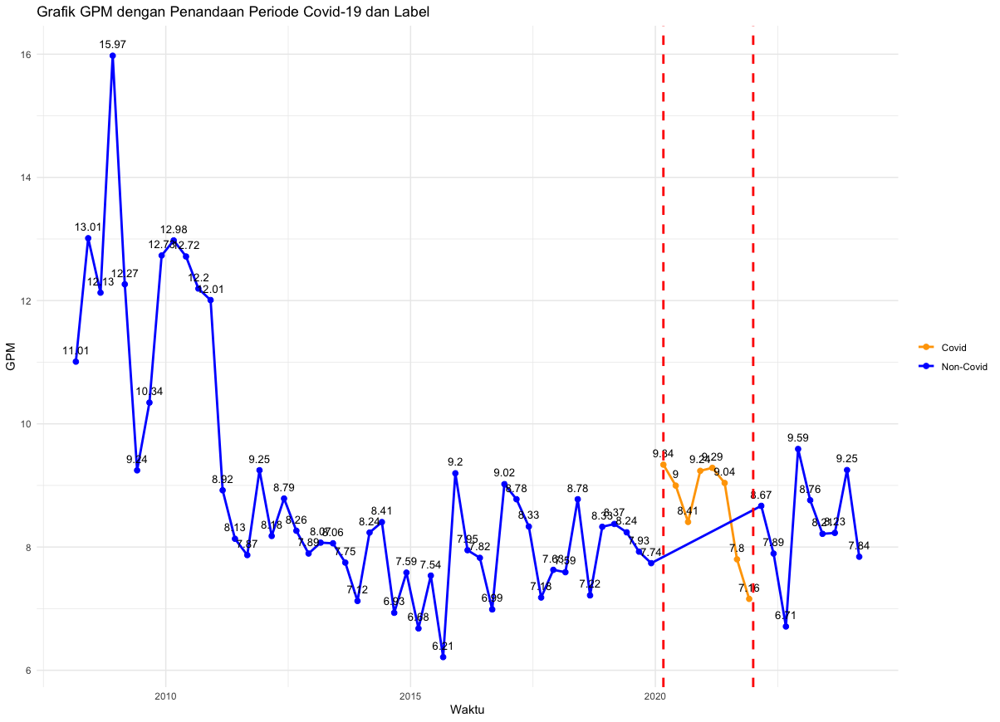
[1] Bagaimana kondisi Perusahaan sejak terjadinya pandemi Covid-19
```
    Selama pandemi Covid-19, khususnya mulai Q1-2020 hingga akhir periode yang ditandai dalam grafik, Gross Profit Margin (GPM) perusahaan mengalami perubahan yang mencerminkan dampak langsung pandemi terhadap efisiensi operasional.

    Awal Pandemi:
    Pada awal pandemi, GPM perusahaan berada di angka 9.84, yang cukup stabil dibandingkan periode sebelumnya. Namun, seiring berjalannya pandemi, GPM menurun tajam hingga mencapai titik terendah pada 8.67. Penurunan ini mengindikasikan adanya tekanan signifikan pada efisiensi perusahaan dalam menghasilkan laba kotor dari pendapatan. Faktor-faktor seperti gangguan pada rantai pasokan, kenaikan biaya bahan baku, atau penurunan volume penjualan kemungkinan menjadi penyebab utama tekanan ini.

    Pemulihan Selama Pandemi:
Setelah penurunan awal, perusahaan berhasil menunjukkan tanda-tanda pemulihan. GPM perlahan naik kembali ke 9.24, meskipun belum mencapai level awal pandemi. Hal ini menunjukkan adanya perbaikan dalam efisiensi operasional, yang mungkin disebabkan oleh pengendalian biaya yang lebih ketat, perbaikan manajemen rantai pasok, atau strategi lain untuk mengatasi tantangan pandemi.

    Perusahaan menghadapi tekanan signifikan terhadap efisiensinya di awal pandemi, yang terlihat dari penurunan GPM. Namun, langkah-langkah pemulihan yang dilakukan berhasil meningkatkan GPM ke tingkat yang lebih baik meskipun pandemi masih berlangsung. Hal ini menunjukkan kemampuan perusahaan untuk beradaptasi dengan kondisi yang sulit dan menjaga kinerja operasionalnya di tengah tantangan besar.
```
[2] Apakah ada perbedaan kondisi Perusahaan sejak terjadinya Covid-19 (pertanyaan 1) dibandingkan dengan sebelum terjadi Covid-19 berdasarkan rasio keuangan
```
Berdasarkan grafik Gross Profit Margin (GPM), terdapat perbedaan yang signifikan dalam kondisi perusahaan sebelum dan setelah pandemi Covid-19, yang mencerminkan perubahan dalam efisiensi perusahaan menghasilkan laba kotor dari pendapatannya.

Kondisi Sebelum Covid-19:
Sebelum pandemi, GPM perusahaan menunjukkan tren menurun jangka panjang yang cukup konsisten. Nilai GPM tertinggi terlihat di awal grafik, yaitu 15.97, tetapi perlahan menurun hingga berada di rentang yang lebih rendah sekitar 7.41 hingga 9.94 pada periode sebelum pandemi. Penurunan ini mengindikasikan adanya tekanan pada efisiensi operasional perusahaan, yang kemungkinan disebabkan oleh meningkatnya biaya produksi, fluktuasi permintaan pasar, atau perubahan struktur pendapatan perusahaan.

Meskipun terdapat beberapa periode stabilitas di sekitar nilai 8 hingga 9, tren keseluruhan menunjukkan bahwa sebelum pandemi, perusahaan mengalami kesulitan untuk mempertahankan efisiensi biaya operasionalnya. Penurunan ini mencerminkan tantangan struktural dalam pengelolaan biaya dan daya saing yang mungkin membutuhkan perhatian khusus.

Kondisi Setelah Covid-19:
Setelah pandemi, GPM perusahaan terlihat bergerak pada rentang yang lebih stabil dibandingkan sebelumnya. Nilai GPM berada di kisaran 8.76 hingga 9.59, yang meskipun tidak menunjukkan perbaikan signifikan dibandingkan sebelum pandemi, memberikan indikasi bahwa perusahaan berhasil mencapai stabilitas dalam efisiensi operasionalnya.

Konsistensi GPM pasca-pandemi menunjukkan bahwa perusahaan mampu menjaga efisiensi produksinya meskipun tantangan global akibat pandemi masih terasa. Stabilitas ini juga dapat mencerminkan keberhasilan perusahaan dalam mengelola biaya produksi dan operasionalnya dengan lebih baik di tengah perubahan pasar yang signifikan. Tidak ada tren menurun seperti yang terlihat sebelum pandemi, yang menunjukkan bahwa perusahaan telah beradaptasi untuk menjaga margin laba kotor pada level yang relatif stabil.
```

## Operating Profit Margin (OPM)

[1] Bagaimana kondisi Perusahaan sejak terjadinya pandemi Covid-19
```
    Sejak dimulainya pandemi Covid-19 pada Q1-2020, rasio Operating Profit Margin (OPM) perusahaan mencerminkan adaptasi perusahaan terhadap tekanan pandemi dan kemampuan menjaga efisiensi operasional.

    Kondisi Awal Pandemi (Q1-2020):
Pada awal pandemi, OPM perusahaan berada pada level 5.75, yang relatif stabil dibandingkan beberapa periode sebelumnya. Namun, pandemi memberikan tekanan terhadap margin operasional perusahaan, yang terlihat dari penurunan OPM ke level 5.06 di kuartal berikutnya. Penurunan ini menunjukkan bahwa meskipun pendapatan mungkin menurun, perusahaan masih menanggung biaya operasional yang cukup besar, sehingga menekan laba operasionalnya.

    Pemulihan Selama Pandemi:
Setelah penurunan awal, perusahaan mulai menunjukkan pemulihan dalam margin operasional. OPM meningkat secara perlahan hingga mencapai puncaknya di 5.85 selama pandemi. Peningkatan ini menunjukkan bahwa perusahaan mampu melakukan penyesuaian operasional, seperti pengendalian biaya, optimalisasi efisiensi, atau strategi lain untuk meningkatkan laba operasional meskipun kondisi eksternal penuh tantangan.

    Akhir Periode Pandemi dan Setelahnya:
Setelah periode awal pemulihan, OPM stabil pada kisaran yang lebih tinggi dibandingkan awal pandemi, sebelum akhirnya menunjukkan sedikit peningkatan hingga level 6.65 setelah pandemi. Stabilitas ini menandakan bahwa perusahaan berhasil menyeimbangkan pendapatan dan biaya operasional, mempertahankan efisiensi dalam menghadapi tantangan yang tersisa dari dampak pandemi.
    Secara keseluruhan, meskipun pandemi memberikan tekanan signifikan terhadap efisiensi operasional perusahaan pada awalnya, langkah-langkah pemulihan yang dilakukan terbukti efektif. Peningkatan dan stabilitas OPM selama dan setelah pandemi menunjukkan bahwa perusahaan mampu beradaptasi dan mengelola sumber dayanya dengan baik di tengah tantangan besar.
```
[2] Apakah ada perbedaan kondisi Perusahaan sejak terjadinya Covid-19 (pertanyaan 1) dibandingkan dengan sebelum terjadi Covid-19 berdasarkan rasio keuangan
```
    Berdasarkan grafik Operating Profit Margin (OPM), terlihat perbedaan yang signifikan dalam kondisi perusahaan sebelum dan setelah pandemi Covid-19, yang mencerminkan efisiensi perusahaan dalam menghasilkan laba operasional dari pendapatannya.

Kondisi Sebelum Covid-19:
    Sebelum pandemi, OPM perusahaan menunjukkan pola fluktuasi yang cukup signifikan. Nilai OPM berada pada kisaran 4.28 hingga 6.31, dengan beberapa penurunan tajam hingga ke level sekitar 2.22. Meskipun ada periode-periode di mana OPM meningkat, tren keseluruhan menunjukkan ketidakstabilan dalam efisiensi operasional perusahaan. Ketidakstabilan ini dapat mencerminkan tantangan dalam pengelolaan biaya operasional, dinamika pasar, atau perubahan dalam struktur pendapatan perusahaan.

    Namun, pada periode menjelang pandemi, perusahaan mulai menunjukkan tanda-tanda stabilitas yang lebih baik, dengan OPM berkisar di sekitar angka 5.02 hingga 5.76. Hal ini menunjukkan adanya perbaikan efisiensi operasional yang mulai terwujud sebelum pandemi melanda.

Kondisi Setelah Covid-19:
    Setelah pandemi, OPM perusahaan menunjukkan peningkatan yang lebih stabil. Nilai OPM naik ke kisaran yang lebih tinggi, mencapai 6.55 hingga 7.08 pada beberapa periode pasca-pandemi. Peningkatan ini menunjukkan bahwa perusahaan mampu meningkatkan efisiensi operasionalnya meskipun menghadapi tantangan global. Stabilitas ini mencerminkan keberhasilan perusahaan dalam mengoptimalkan operasional, mengendalikan biaya, dan mungkin mengambil keuntungan dari pemulihan ekonomi setelah pandemi.

    Periode pasca-pandemi juga menunjukkan pengurangan dalam fluktuasi OPM, yang mencerminkan pengelolaan operasional yang lebih konsisten dan efisien dibandingkan dengan periode sebelumnya.
```

### Debt-to-Equity Ratio (DER)

[1] Bagaimana kondisi Perusahaan sejak terjadinya pandemi Covid-19
```
    Berdasarkan grafik Debt-to-Equity Ratio (DER) yang diberikan, berikut adalah analisis mengenai kondisi perusahaan selama pandemi Covid-19 (Q1-2020 hingga akhir periode yang terlihat), termasuk informasi terkait data yang hilang.

    Pada awal pandemi, nilai DER perusahaan berada pada level 9.19. Nilai ini sangat rendah jika dibandingkan dengan periode-periode sebelum pandemi, yang menunjukkan bahwa perusahaan memiliki tingkat leverage yang jauh lebih kecil. Penurunan ini kemungkinan disebabkan oleh langkah perusahaan untuk mengurangi utang atau memperkuat ekuitas guna menghadapi ketidakpastian ekonomi yang ditimbulkan oleh pandemi. DER yang rendah mencerminkan struktur keuangan yang lebih konservatif, di mana perusahaan cenderung mengurangi ketergantungan pada utang selama masa penuh tantangan.

    Pada periode pandemi (sekitar Q2 hingga Q3-2020), terlihat adanya gap dalam data DER. Tidak adanya data pada periode ini bisa disebabkan oleh kendala pelaporan selama pandemi, baik akibat gangguan operasional internal perusahaan maupun kendala eksternal, seperti pembatasan aktivitas ekonomi atau keterbatasan pelaporan keuangan.

    Setelah periode data yang hilang, DER kembali dilaporkan dengan nilai 10.92 pada akhir pandemi. Meskipun masih relatif rendah, ini menunjukkan bahwa perusahaan menjaga kebijakan leverage konservatif selama pandemi untuk meminimalkan risiko keuangan. Nilai DER yang stabil pada kisaran rendah ini mencerminkan manajemen risiko yang efektif, dengan perusahaan cenderung menghindari penambahan utang signifikan selama kondisi ekonomi yang tidak pasti.

    Setelah pandemi, DER mulai menunjukkan sedikit peningkatan ke level 14.35. Meskipun demikian, nilai ini masih berada di bawah rata-rata DER perusahaan pada tahun-tahun sebelum pandemi. Peningkatan ini mungkin mengindikasikan adanya langkah strategis untuk memanfaatkan kembali pembiayaan berbasis utang guna mendukung pertumbuhan operasional, seiring mulai pulihnya kondisi ekonomi global.

    Secara keseluruhan, pandemi Covid-19 memberikan tantangan signifikan, tetapi perusahaan berhasil mempertahankan struktur keuangan yang konservatif dan beradaptasi dengan baik terhadap ketidakpastian. Meskipun terdapat gap data selama pandemi, kebijakan pengelolaan leverage yang hati-hati mencerminkan strategi yang solid dalam menjaga stabilitas keuangan perusahaan.
```
[2] Apakah ada perbedaan kondisi Perusahaan sejak terjadinya Covid-19 (pertanyaan 1) dibandingkan dengan sebelum terjadi Covid-19 berdasarkan rasio keuangan
```
    Berdasarkan grafik Debt-to-Equity Ratio (DER), terdapat perubahan signifikan antara kondisi perusahaan sebelum dan setelah pandemi Covid-19. DER mencerminkan seberapa besar proporsi utang perusahaan dibandingkan ekuitasnya, dan grafik ini memberikan wawasan tentang strategi pembiayaan perusahaan di kedua periode tersebut.

Kondisi Sebelum Covid-19:
    Sebelum pandemi, DER perusahaan cenderung menunjukkan tren penurunan yang signifikan dari nilai puncak 157.76 menjadi sekitar 9.19 pada periode menjelang pandemi. Tren ini mengindikasikan bahwa perusahaan secara bertahap mengurangi ketergantungannya pada utang untuk membiayai aktivitasnya. Penurunan ini mungkin mencerminkan upaya perusahaan untuk mengadopsi struktur permodalan yang lebih konservatif, dengan fokus pada pengurangan risiko keuangan melalui pelunasan utang atau peningkatan ekuitas.

    Namun, meskipun ada tren penurunan, grafik menunjukkan fluktuasi DER yang cukup besar selama beberapa tahun sebelum pandemi. Ini menunjukkan bahwa, meskipun perusahaan berhasil mengurangi leverage-nya secara bertahap, masih ada periode di mana perusahaan menghadapi tekanan keuangan atau mengambil langkah pembiayaan tambahan yang menyebabkan peningkatan sementara pada DER.

Kondisi Setelah Covid-19:
    Setelah pandemi, DER menunjukkan pola stabilitas yang lebih baik dibandingkan dengan periode sebelumnya. Nilai DER berada dalam kisaran 12.08 hingga 23.58, yang meskipun lebih tinggi dibandingkan nilai terendah sebelum pandemi, tetap mencerminkan struktur permodalan yang sehat. Stabilitas ini mengindikasikan bahwa perusahaan telah berhasil menjaga keseimbangan antara utang dan ekuitasnya, dengan menghindari peningkatan leverage yang signifikan.

    Peningkatan moderat pada DER setelah pandemi mungkin mencerminkan langkah strategis perusahaan untuk memanfaatkan kembali pembiayaan berbasis utang guna mendukung pemulihan dan pertumbuhan operasional pasca-pandemi. Namun, nilai yang tetap rendah secara historis menunjukkan bahwa perusahaan tetap mempertahankan pendekatan konservatif dalam struktur pembiayaannya.
```
### Current Ratio (CR)
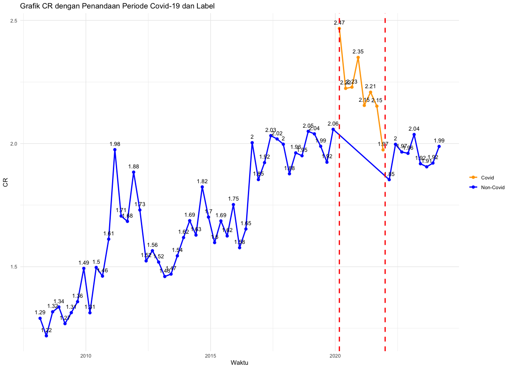
[1] Bagaimana kondisi Perusahaan sejak terjadinya pandemi Covid-19
```
    Selama pandemi Covid-19, perusahaan menunjukkan kemampuan yang solid dalam menjaga likuiditasnya, yang tercermin dari rasio Current Ratio (CR). Pada awal pandemi di Q1-2020, CR perusahaan berada pada angka 2.17, menunjukkan bahwa perusahaan memiliki aset lancar yang lebih dari cukup untuk memenuhi kewajiban jangka pendeknya. Kondisi ini mencerminkan tingkat likuiditas yang sehat dan strategi manajemen yang hati-hati di tengah situasi ekonomi yang tidak menentu.

    Seiring berjalannya pandemi, perusahaan berhasil meningkatkan CR hingga mencapai puncaknya di angka 2.35. Peningkatan ini menunjukkan adanya upaya proaktif perusahaan dalam memperkuat likuiditasnya. Langkah ini mungkin dilakukan dengan meningkatkan kas atau setara kas untuk mengantisipasi ketidakpastian ekonomi selama pandemi. Langkah strategis ini memberikan perusahaan kemampuan yang lebih besar untuk menghadapi potensi risiko keuangan akibat gangguan operasional dan ekonomi.

    Namun, setelah mencapai puncak tersebut, CR mulai menurun secara moderat hingga kembali ke angka 2.15. Penurunan ini mencerminkan bahwa perusahaan mulai mengelola aset lancarnya secara lebih optimal, kemungkinan sebagai respons terhadap stabilisasi kondisi operasional. Meskipun demikian, penurunan ini tidak mengindikasikan risiko likuiditas karena nilai CR tetap berada dalam rentang sehat yang memungkinkan perusahaan untuk memenuhi kewajibannya tanpa kesulitan berarti.

    Menjelang akhir periode pandemi, CR perusahaan stabil di angka sekitar 2.04 hingga 1.99. Meskipun sedikit lebih rendah dibandingkan puncak selama pandemi, nilai ini tetap berada di atas rata-rata sebelum pandemi, menunjukkan bahwa perusahaan mampu mempertahankan stabilitas likuiditasnya meskipun tantangan global masih berlangsung. Tren ini mengindikasikan pengelolaan keuangan yang baik dengan menjaga keseimbangan antara likuiditas dan efisiensi penggunaan aset lancar.

    Secara keseluruhan, selama pandemi Covid-19, perusahaan menunjukkan langkah antisipatif yang kuat di awal pandemi dengan meningkatkan likuiditasnya secara signifikan. Stabilitas yang terlihat di periode berikutnya mengindikasikan kemampuan perusahaan untuk beradaptasi dengan tantangan eksternal tanpa mengorbankan efisiensi keuangannya. Hal ini mencerminkan strategi pengelolaan keuangan yang efektif dan hati-hati selama masa penuh ketidakpastian.
```
[2] Apakah ada perbedaan kondisi Perusahaan sejak terjadinya Covid-19 (pertanyaan 1) dibandingkan dengan sebelum terjadi Covid-19 berdasarkan rasio keuangan
```
Berdasarkan grafik Current Ratio (CR), terlihat adanya perubahan dalam likuiditas perusahaan antara periode sebelum dan setelah pandemi Covid-19. CR mencerminkan kemampuan perusahaan untuk memenuhi kewajiban jangka pendeknya menggunakan aset lancar, sehingga memberikan gambaran tentang stabilitas keuangan perusahaan.

Kondisi Sebelum Covid-19:
Sebelum pandemi, CR perusahaan menunjukkan tren peningkatan yang bertahap sejak periode awal grafik. Nilai CR meningkat dari kisaran 1.29 di tahun-tahun awal grafik ke angka sekitar 2.06 menjelang pandemi. Tren ini mencerminkan upaya perusahaan untuk memperkuat posisi likuiditasnya, yang mungkin dilakukan melalui peningkatan aset lancar atau pengelolaan kewajiban jangka pendek yang lebih baik.

Namun, meskipun terdapat peningkatan bertahap, grafik juga menunjukkan fluktuasi pada nilai CR, dengan beberapa periode di mana nilai CR turun sementara, seperti ke angka 1.95. Fluktuasi ini menunjukkan bahwa, meskipun perusahaan berhasil memperkuat likuiditasnya secara keseluruhan, ada tekanan pada likuiditas di beberapa periode akibat faktor internal atau eksternal tertentu.

Kondisi Setelah Covid-19:
Setelah pandemi, CR menunjukkan stabilitas yang lebih baik dibandingkan periode sebelumnya. Nilai CR bergerak di kisaran 1.99 hingga 2.04, mencerminkan kemampuan perusahaan untuk menjaga tingkat likuiditas yang sehat meskipun menghadapi tantangan pasca-pandemi. Stabilitas ini menunjukkan bahwa perusahaan mampu mempertahankan pengelolaan aset lancar dan kewajiban jangka pendeknya secara konsisten.

Tidak seperti periode sebelum pandemi yang menunjukkan fluktuasi besar, periode pasca-pandemi lebih menunjukkan konsistensi dalam nilai CR. Hal ini menunjukkan bahwa perusahaan telah mengadopsi strategi likuiditas yang lebih matang, dengan memastikan keseimbangan antara aset lancar dan kewajiban jangka pendeknya.
```
### Interest Coverage Ratio (ICR)
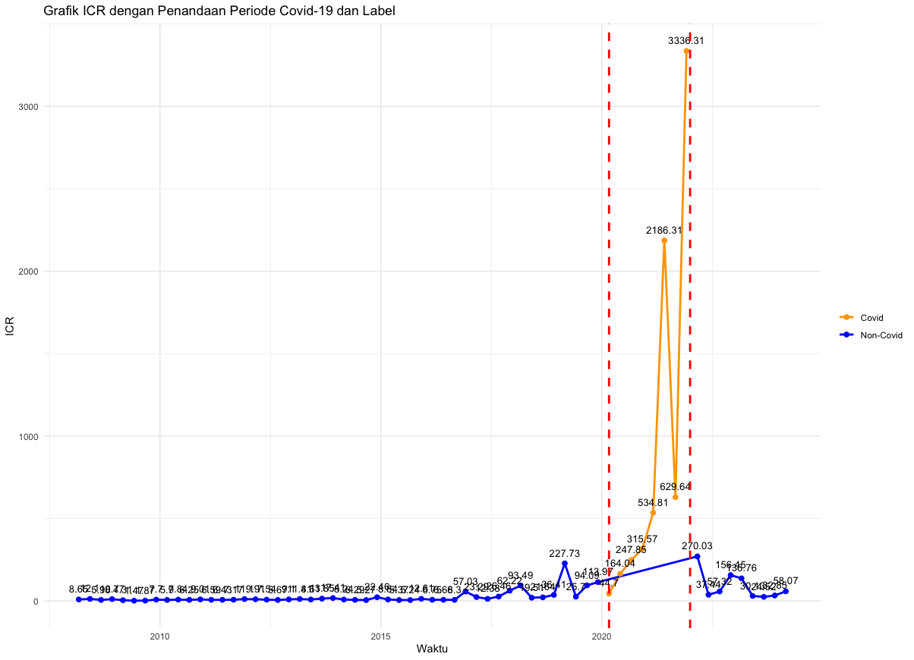
[1] Bagaimana kondisi Perusahaan sejak terjadinya pandemi Covid-19
```
Selama pandemi Covid-19, rasio Interest Coverage Ratio (ICR) perusahaan mengalami perubahan signifikan yang mencerminkan kemampuan perusahaan dalam membayar beban bunga dari pendapatan operasionalnya. Grafik menunjukkan adanya lonjakan luar biasa pada ICR selama periode pandemi.

Pada awal pandemi, ICR perusahaan berada pada level 315.57, yang mencerminkan kemampuan yang sangat baik dalam menutupi beban bunga menggunakan pendapatan operasionalnya. Namun, selama pandemi berlangsung, ICR meningkat drastis hingga mencapai puncaknya di angka 3336.31. Lonjakan ini mengindikasikan bahwa pendapatan operasional perusahaan relatif meningkat secara signifikan atau bahwa beban bunga perusahaan mengalami penurunan drastis selama periode tersebut.

Peningkatan tajam ini bisa mencerminkan langkah strategis perusahaan, seperti pengurangan utang berbunga tinggi atau efisiensi dalam manajemen operasional selama pandemi. Namun, lonjakan yang sangat tinggi ini juga dapat mencerminkan pengaruh faktor non-operasional, seperti perubahan signifikan dalam struktur pembiayaan atau kebijakan akuntansi yang memengaruhi perhitungan beban bunga.

Setelah mencapai puncaknya, ICR mulai menurun kembali, meskipun tetap pada level yang jauh lebih tinggi dibandingkan sebelum pandemi. Pada akhir periode yang terlihat, ICR berada di kisaran 156.46 hingga 258.07. Penurunan ini mungkin mencerminkan stabilisasi operasional perusahaan setelah dampak awal pandemi, tetapi nilai yang tetap tinggi menunjukkan bahwa perusahaan masih memiliki kapasitas yang sangat baik untuk memenuhi kewajiban bunganya.

Kesimpulan Selama Pandemi:
Selama pandemi, perusahaan menunjukkan kemampuan luar biasa dalam menutupi beban bunga, yang tercermin dari lonjakan tajam ICR. Hal ini menunjukkan bahwa perusahaan mampu mempertahankan arus kas operasional yang kuat atau berhasil mengurangi beban bunga secara signifikan selama masa penuh tantangan. Meskipun ICR menurun di akhir pandemi, nilainya tetap mencerminkan kekuatan finansial perusahaan yang signifikan.

Secara keseluruhan, pandemi Covid-19 membawa perubahan besar pada ICR perusahaan, dengan peningkatan yang mencolok menunjukkan efisiensi keuangan dan langkah-langkah strategis yang berhasil dalam menjaga stabilitas keuangan perusahaan selama periode yang penuh ketidakpastian.
```
[2] Apakah ada perbedaan kondisi Perusahaan sejak terjadinya Covid-19 (pertanyaan 1) dibandingkan dengan sebelum terjadi Covid-19 berdasarkan rasio keuangan
```
    Berdasarkan grafik Interest Coverage Ratio (ICR), terdapat perbedaan signifikan antara kondisi perusahaan sebelum dan setelah pandemi Covid-19. ICR mencerminkan kemampuan perusahaan untuk membayar beban bunga dari laba operasionalnya, yang menjadi indikator penting dalam mengukur kesehatan keuangan dan risiko likuiditas perusahaan.

Kondisi Sebelum Covid-19:
    Sebelum pandemi, nilai ICR perusahaan cenderung stabil pada angka yang relatif rendah, berkisar di bawah 100 dengan beberapa peningkatan kecil di periode tertentu. Misalnya, pada periode menjelang pandemi, ICR mencapai nilai tertinggi sekitar 315.57, yang mencerminkan adanya perbaikan moderat dalam kemampuan perusahaan menutupi beban bunga. Namun, tren secara keseluruhan menunjukkan bahwa perusahaan memiliki keterbatasan dalam menjaga margin keuangan yang cukup untuk memenuhi kewajiban bunga dengan nyaman.

    Stabilitas pada nilai rendah ini mungkin disebabkan oleh tekanan operasional yang menyebabkan laba sebelum bunga dan pajak (EBIT) tidak tumbuh secara signifikan, atau akibat tingginya beban bunga yang dihadapi perusahaan sebelum pandemi.

Kondisi Setelah Covid-19:
    Setelah pandemi, ICR menunjukkan peningkatan yang signifikan tetapi fluktuatif. Nilai ICR bergerak ke kisaran yang jauh lebih tinggi, dimulai dari 156.46 hingga mencapai puncaknya di 270.03. Peningkatan ini mencerminkan bahwa perusahaan mampu memperbaiki efisiensi operasionalnya, atau mungkin juga terjadi pengurangan dalam beban bunga. Stabilitas pasca-pandemi pada nilai yang lebih tinggi menunjukkan adanya perbaikan dalam pengelolaan struktur keuangan perusahaan.

    Namun, peningkatan signifikan selama pandemi menunjukkan adanya faktor sementara atau langkah strategis seperti pelunasan utang berbunga tinggi, yang memberikan dampak positif pada kemampuan perusahaan untuk membayar bunga. Hal ini memberikan fondasi yang lebih stabil dalam menjaga kesehatan keuangannya pasca-pandemi.

    Secara keseluruhan, sebelum pandemi, perusahaan beroperasi dengan margin keuangan yang lebih terbatas dalam menutupi beban bunga. Setelah pandemi, perusahaan menunjukkan peningkatan signifikan dalam kemampuan membayar bunga, yang mencerminkan perbaikan efisiensi dan strategi pengelolaan keuangan yang lebih efektif. Perbaikan ini memberikan indikasi bahwa perusahaan telah belajar dari tantangan pandemi dan mampu memperkuat stabilitas keuangannya di periode pasca-pandemi.
```


1.	Bagaimana kondisi Perusahaan sejak terjadinya pandemi Covid-19, yaitu mulai Q1-2020 sampai periode terakhir berdasarkan rasio keuangan ROA, ROE, GPM, OPM, DER, CR, dan ICR?

2.	Apakah ada perbedaan kondisi Perusahaan sejak terjadinya Covid-19 (pertanyaan 1) dibandingkan dengan sebelum terjadi Covid-19 berdasarkan rasio keuangan ROA, ROE, GPM, OPM, DER, CR, dan ICR?

3.	Apakah ada informasi lain selain rasio keuangan ROA, ROE, GPM, OPM, DER, CR, dan ICR yang membedakan kondisi Perusahaan sebelum dan sesudah Covid-19?
4.	Apabila ada hipotesis bahwa USDIDR berpengaruh terhadap kinerja Perusahaan berdasarkan rasio keuangan ROA, ROE, GPM, OPM, DER, CR, dan ICR, maka lakukan analisis apakah hipotesis tersebut dapat dibuktikan benar atau tidak?

## Return on Assets (ROA) VS USDIDR
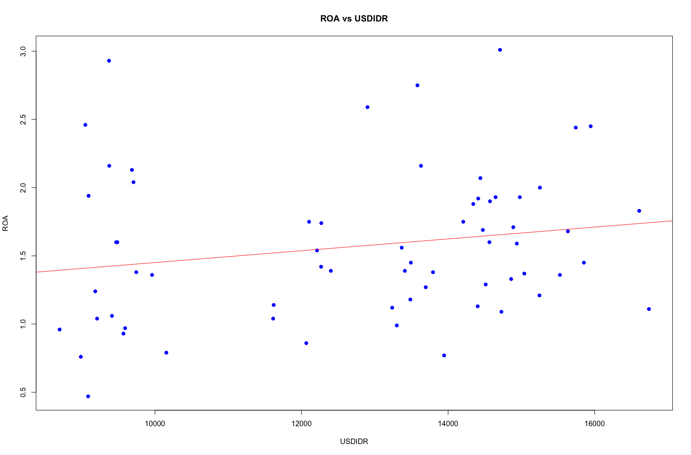

```
===== Model untuk ROA =====

Call:
lm(formula = formula, data = data)

Residuals:
     Min       1Q   Median       3Q      Max 
-0.94131 -0.38093 -0.07458  0.26364  1.50635 

Coefficients:
             Estimate Std. Error t value Pr(>|t|)   
(Intercept) 1.018e+00  3.626e-01   2.807  0.00664 **
USDIDR      4.330e-05  2.795e-05   1.549  0.12645   
---
Signif. codes:  0 ‘***’ 0.001 ‘**’ 0.01 ‘*’ 0.05 ‘.’ 0.1 ‘ ’ 1

Residual standard error: 0.5412 on 63 degrees of freedom
Multiple R-squared:  0.03668,	Adjusted R-squared:  0.02139 
F-statistic: 2.399 on 1 and 63 DF,  p-value: 0.1264
```
Penjelasan :
```
    Model regresi ini mengevaluasi pengaruh nilai tukar USD terhadap ROA. Koefisien intercept sebesar 1.018 menunjukkan bahwa ketika USDIDR bernilai nol, ROA diperkirakan sebesar 1.018. Koefisien untuk USDIDR sebesar 0.0000433 menunjukkan bahwa setiap kenaikan satu unit USDIDR diharapkan meningkatkan ROA sebesar 0.0000433. Namun, nilai p untuk USDIDR adalah 0.1264, yang berarti pengaruh ini tidak signifikan secara statistik pada tingkat signifikansi 5%. Nilai Adjusted R-squared sebesar 0.02139 menunjukkan bahwa hanya sekitar 2.14% variasi ROA yang dapat dijelaskan oleh USDIDR.

```

## Return on Equity (ROE) vs USDIDR

```
===== Model untuk ROE =====

Call:
lm(formula = formula, data = data)

Residuals:
    Min      1Q  Median      3Q     Max 
-3.8736 -1.1745 -0.2501  0.9048  5.5563 

Coefficients:
              Estimate Std. Error t value Pr(>|t|)    
(Intercept)  6.227e+00  1.192e+00   5.222 2.12e-06 ***
USDIDR      -1.049e-04  9.193e-05  -1.141    0.258    
---
Signif. codes:  0 ‘***’ 0.001 ‘**’ 0.01 ‘*’ 0.05 ‘.’ 0.1 ‘ ’ 1

Residual standard error: 1.78 on 63 degrees of freedom
Multiple R-squared:  0.02025,	Adjusted R-squared:  0.004694 
F-statistic: 1.302 on 1 and 63 DF,  p-value: 0.2582
```
Penjelasan :
```
    Dalam model ini, intercept sebesar 6.227 menunjukkan bahwa ROE diperkirakan sebesar 6.227 ketika USDIDR bernilai nol. Koefisien USDIDR sebesar -0.0001049 menunjukkan adanya hubungan negatif antara USDIDR dan ROE, artinya kenaikan USDIDR dapat menurunkan ROE. Namun, nilai p sebesar 0.258 menunjukkan bahwa hubungan ini tidak signifikan secara statistik. Nilai Adjusted R-squared sebesar 0.004694 menunjukkan bahwa hanya sekitar 0.47% variasi ROE yang dijelaskan oleh USDIDR.
```
## Gross Profit Margin (GPM) vs USDIDR


```
===== Model untuk GPM =====

Call:
lm(formula = formula, data = data)

Residuals:
    Min      1Q  Median      3Q     Max 
-2.2136 -1.1974 -0.3283  0.9267  6.9724 

Coefficients:
              Estimate Std. Error t value Pr(>|t|)    
(Intercept)  1.293e+01  1.152e+00  11.228  < 2e-16 ***
USDIDR      -3.168e-04  8.879e-05  -3.568 0.000695 ***
---
Signif. codes:  0 ‘***’ 0.001 ‘**’ 0.01 ‘*’ 0.05 ‘.’ 0.1 ‘ ’ 1

Residual standard error: 1.719 on 63 degrees of freedom
Multiple R-squared:  0.1681,	Adjusted R-squared:  0.1549 
F-statistic: 12.73 on 1 and 63 DF,  p-value: 0.0006953
```
Penjelasan :
```
    Model GPM menunjukkan bahwa intercept sebesar 12.93 berarti GPM diperkirakan sebesar 12.93 ketika USDIDR nol. Koefisien USDIDR sebesar -0.0003168 menunjukkan bahwa setiap kenaikan satu unit USDIDR diharapkan menurunkan GPM sebesar 0.0003168. Nilai p sebesar 0.000695 menunjukkan bahwa hubungan ini signifikan secara statistik pada tingkat signifikansi 1%. Nilai Adjusted R-squared sebesar 0.1549 menunjukkan bahwa sekitar 15.49% variasi GPM dijelaskan oleh USDIDR.
```
## Operating Profit Margin (OPM) vs USDIDR
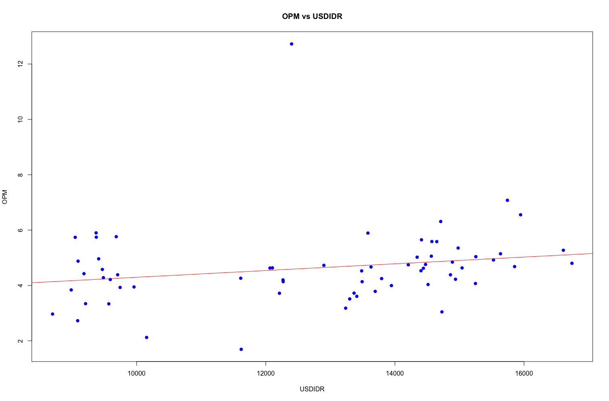
```
===== Model untuk OPM =====

Call:
lm(formula = formula, data = data)

Residuals:
    Min      1Q  Median      3Q     Max 
-2.8015 -0.6736 -0.0831  0.2280  8.1364 

Coefficients:
             Estimate Std. Error t value Pr(>|t|)   
(Intercept) 3.078e+00  9.345e-01   3.294  0.00162 **
USDIDR      1.219e-04  7.205e-05   1.692  0.09563 . 
---
Signif. codes:  0 ‘***’ 0.001 ‘**’ 0.01 ‘*’ 0.05 ‘.’ 0.1 ‘ ’ 1

Residual standard error: 1.395 on 63 degrees of freedom
Multiple R-squared:  0.04346,	Adjusted R-squared:  0.02827 
F-statistic: 2.862 on 1 and 63 DF,  p-value: 0.09563
```
Penjelasan :
```
    Pada model OPM, intercept sebesar 3.078 menunjukkan bahwa OPM diperkirakan sebesar 3.078 ketika USDIDR nol. Koefisien USDIDR sebesar 0.0001219 menunjukkan adanya hubungan positif antara USDIDR dan OPM, artinya kenaikan USDIDR dapat meningkatkan OPM. Nilai p sebesar 0.09563 menunjukkan bahwa hubungan ini mendekati signifikan pada tingkat signifikansi 10%. Nilai Adjusted R-squared sebesar 0.02827 menunjukkan bahwa sekitar 2.83% variasi OPM dijelaskan oleh USDIDR.
```
## Debt-to-Equity Ratio (DER) vs USDIDR
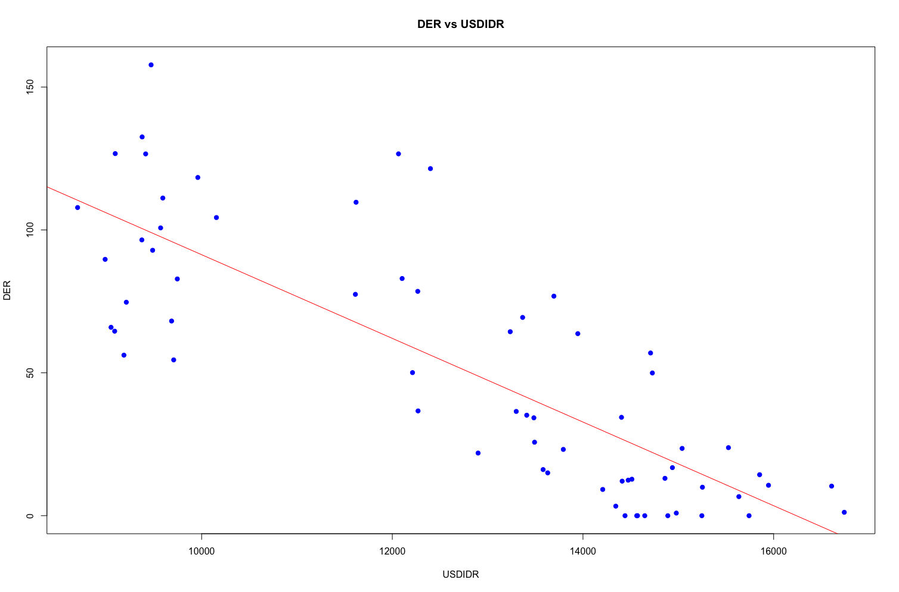
```
===== Model untuk DER =====

Call:
lm(formula = formula, data = data)

Residuals:
    Min      1Q  Median      3Q     Max 
-47.066 -19.672  -5.963  15.849  65.565 

Coefficients:
              Estimate Std. Error t value Pr(>|t|)    
(Intercept) 237.820979  17.177602   13.85   <2e-16 ***
USDIDR       -0.014651   0.001324  -11.06   <2e-16 ***
---
Signif. codes:  0 ‘***’ 0.001 ‘**’ 0.01 ‘*’ 0.05 ‘.’ 0.1 ‘ ’ 1

Residual standard error: 25.64 on 63 degrees of freedom
Multiple R-squared:  0.6602,	Adjusted R-squared:  0.6548 
F-statistic: 122.4 on 1 and 63 DF,  p-value: < 2.2e-16

```
Penjelasan :
```
   Model DER menunjukkan bahwa intercept sebesar 237.82 berarti DER diperkirakan sebesar 237.82 ketika USDIDR nol. Koefisien USDIDR sebesar -0.014651 menunjukkan bahwa setiap kenaikan satu unit USDIDR diharapkan menurunkan DER sebesar 0.014651. Nilai p sebesar < 2.2e-16 menunjukkan bahwa hubungan ini sangat signifikan secara statistik. Nilai Adjusted R-squared sebesar 0.6548 menunjukkan bahwa sekitar 65.48% variasi DER dijelaskan oleh USDIDR, yang menunjukkan model ini sangat baik.
```
### Current Ratio (CR) vs USDIDR
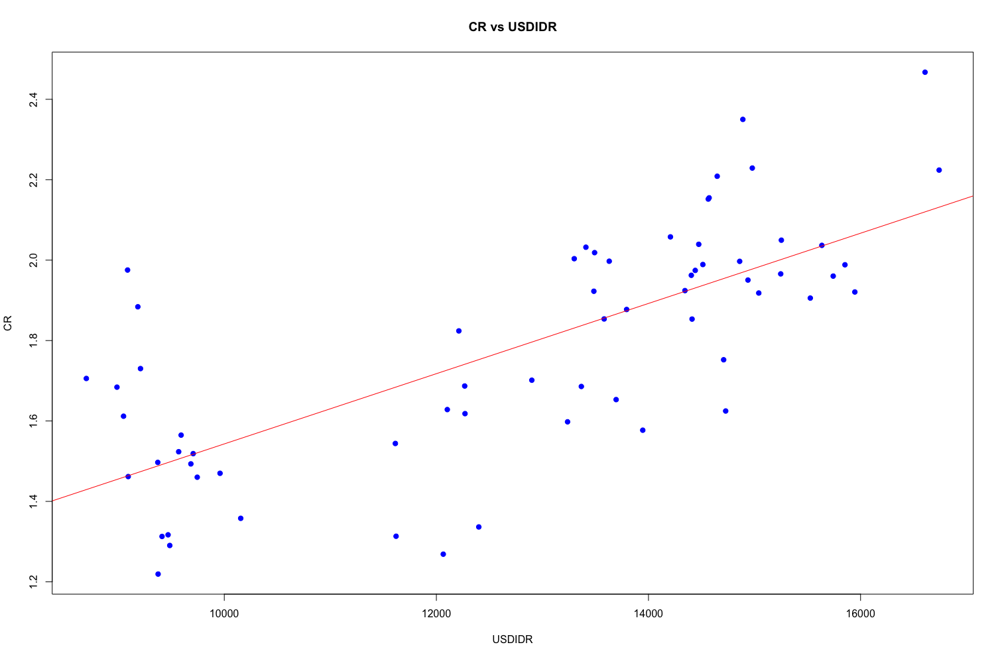

```
===== Model untuk CR =====

Call:
lm(formula = formula, data = data)

Residuals:
     Min       1Q   Median       3Q      Max 
-0.45447 -0.12286  0.00147  0.13744  0.51209 

Coefficients:
             Estimate Std. Error t value Pr(>|t|)    
(Intercept) 6.698e-01  1.346e-01   4.976 5.30e-06 ***
USDIDR      8.731e-05  1.038e-05   8.413 6.78e-12 ***
---
Signif. codes:  0 ‘***’ 0.001 ‘**’ 0.01 ‘*’ 0.05 ‘.’ 0.1 ‘ ’ 1

Residual standard error: 0.2009 on 63 degrees of freedom
Multiple R-squared:  0.5291,	Adjusted R-squared:  0.5216 
F-statistic: 70.78 on 1 and 63 DF,  p-value: 6.779e-12
```
Penjelasan :
```
   Dalam model CR, intercept sebesar 0.6698 menunjukkan bahwa CR diperkirakan sebesar 0.6698 ketika USDIDR nol. Koefisien USDIDR sebesar 0.00008731 menunjukkan adanya hubungan positif antara USDIDR dan CR, artinya kenaikan USDIDR dapat meningkatkan CR. Nilai p sebesar 6.78e-12 menunjukkan bahwa hubungan ini sangat signifikan secara statistik. Nilai Adjusted R-squared sebesar 0.5216 menunjukkan bahwa sekitar 52.16% variasi CR dijelaskan oleh USDIDR, yang menunjukkan model ini cukup baik.


```

### Interest Coverage Ratio (ICR) vs USDIDR
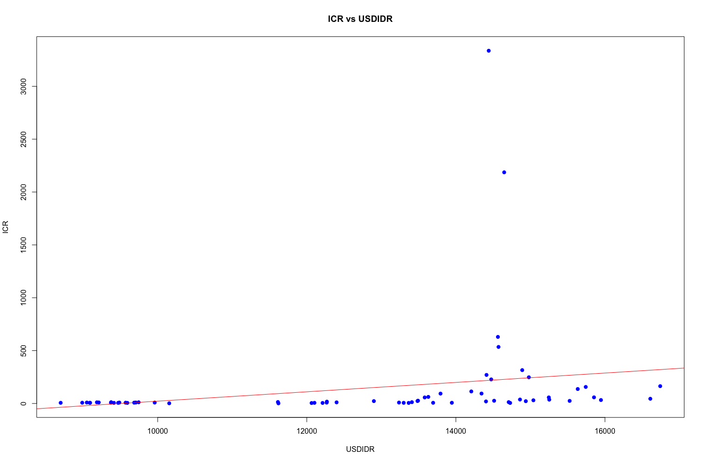

```
===== Model untuk ICR =====

Call:
lm(formula = formula, data = data)

Residuals:
    Min      1Q  Median      3Q     Max 
-270.90 -162.40 -109.25    9.32 3116.94 

Coefficients:
              Estimate Std. Error t value Pr(>|t|)  
(Intercept) -421.92241  326.01626  -1.294   0.2003  
USDIDR         0.04441    0.02514   1.767   0.0821 .
---
Signif. codes:  0 ‘***’ 0.001 ‘**’ 0.01 ‘*’ 0.05 ‘.’ 0.1 ‘ ’ 1

Residual standard error: 486.6 on 63 degrees of freedom
Multiple R-squared:  0.04721,	Adjusted R-squared:  0.03208 
F-statistic: 3.121 on 1 and 63 DF,  p-value: 0.08211
```
Penjelasan :
```
   Model ICR menunjukkan bahwa intercept sebesar -421.92 berarti ICR diperkirakan sebesar -421.92 ketika USDIDR nol (nilai ini mungkin tidak realistis secara praktis). Koefisien USDIDR sebesar 0.04441 menunjukkan adanya hubungan positif antara USDIDR dan ICR, artinya kenaikan USDIDR dapat meningkatkan ICR. Namun, nilai p sebesar 0.0821 menunjukkan bahwa hubungan ini mendekati signifikan pada tingkat signifikansi 10%. Nilai Adjusted R-squared sebesar 0.03208 menunjukkan bahwa sekitar 3.21% variasi ICR dijelaskan oleh USDIDR.
```

### Analisis Multivariat (MANOVA)

```
          Df  Pillai approx F num Df den Df    Pr(>F)    
USDIDR     1 0.70336   19.307      7     57 5.918e-13 ***
Residuals 63                                             
---
Signif. codes:  0 ‘***’ 0.001 ‘**’ 0.01 ‘*’ 0.05 ‘.’ 0.1 ‘ ’ 1
```
Penjelasan :
```
    Hasil MANOVA menggunakan statistik Pillai menunjukkan bahwa secara keseluruhan, USDIDR memiliki pengaruh yang sangat signifikan terhadap kombinasi variabel-variabel dependen (ROA, ROE, GPM, OPM, DER, CR, dan ICR) dengan nilai p sebesar 5.918e-13. Ini berarti bahwa USDIDR secara simultan memengaruhi indikator-indikator keuangan tersebut secara signifikan.
   
```

5.	Apabila diduga tidak hanya USDIDR yang mempengaruhi kinerja Perusahaan, tetapi ada variabel makroekonomi lainnya yang juga berpengaruh, maka lakukan analisis untuk membuktikannya.

## Correlation Analysis
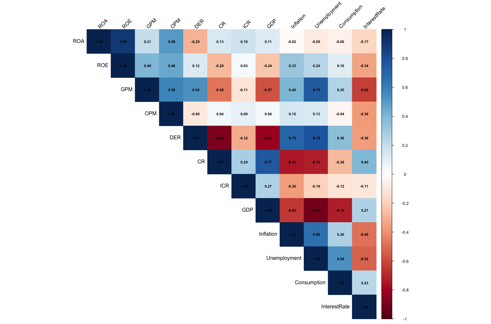
```

                     ROA         ROE        GPM         OPM         DER          CR         ICR         GDP   Inflation Unemployment
ROA           1.00000000  0.89132588  0.2057401  0.50192118 -0.29366129  0.13467359  0.17890738  0.11270098 -0.01806616  -0.08542504
ROE           0.89132588  1.00000000  0.4047299  0.45722770  0.12222799 -0.27917484  0.03394299 -0.23711883  0.32723555   0.24391864
GPM           0.20574010  0.40472988  1.0000000  0.57822095  0.53733465 -0.47646057 -0.11479797 -0.57397775  0.40090708   0.74914013
OPM           0.50192118  0.45722770  0.5782209  1.00000000 -0.09416701  0.04470615  0.08889883  0.03865061  0.14859707   0.13213184
DER          -0.29366129  0.12222799  0.5373347 -0.09416701  1.00000000 -0.88193109 -0.31978345 -0.81273557  0.70434054   0.78314565
CR            0.13467359 -0.27917484 -0.4764606  0.04470615 -0.88193109  1.00000000  0.28864621  0.76894038 -0.74440748  -0.72086230
ICR           0.17890738  0.03394299 -0.1147980  0.08889883 -0.31978345  0.28864621  1.00000000  0.26796534 -0.36459097  -0.19426102
GDP           0.11270098 -0.23711883 -0.5739777  0.03865061 -0.81273557  0.76894038  0.26796534  1.00000000 -0.64914336  -0.90408907
Inflation    -0.01806616  0.32723555  0.4009071  0.14859707  0.70434054 -0.74440748 -0.36459097 -0.64914336  1.00000000   0.65981168
Unemployment -0.08542504  0.24391864  0.7491401  0.13213184  0.78314565 -0.72086230 -0.19426102 -0.90408907  0.65981168   1.00000000
Consumption  -0.05742690  0.10113142  0.2529473 -0.03713486  0.36225320 -0.27620767 -0.11940661 -0.72219230  0.26206585   0.53988425
InterestRate -0.17470583 -0.34062535 -0.6209240 -0.37679959 -0.36210327  0.39927388 -0.10944124  0.26708786 -0.48670272  -0.52086587
             Consumption InterestRate
ROA          -0.05742690   -0.1747058
ROE           0.10113142   -0.3406253
GPM           0.25294730   -0.6209240
OPM          -0.03713486   -0.3767996
DER           0.36225320   -0.3621033
CR           -0.27620767    0.3992739
ICR          -0.11940661   -0.1094412
GDP          -0.72219230    0.2670879
Inflation     0.26206585   -0.4867027
Unemployment  0.53988425   -0.5208659
Consumption   1.00000000    0.2301212
InterestRate  0.23012123    1.0000000
```
Penjelasan :
```
# **Analisis Korelasi Variabel Keuangan dan Makroekonomi**

Analisis ini bertujuan untuk mengevaluasi hubungan antara kinerja keuangan perusahaan, yang direpresentasikan oleh indikator-indikator seperti ROA, ROE, GPM, OPM, DER, CR, dan ICR, dengan variabel makroekonomi seperti GDP, inflasi, tingkat pengangguran, konsumsi masyarakat, dan suku bunga. Pendekatan yang digunakan adalah analisis korelasi Pearson, yang mengukur kekuatan dan arah hubungan linear antara dua variabel. Pemilihan metode ini didasarkan pada kemampuannya untuk memberikan indikasi awal mengenai adanya keterkaitan antara variabel-variabel yang diamati, sehingga memungkinkan identifikasi potensi hubungan yang signifikan untuk analisis lebih lanjut.

Hasil analisis korelasi menunjukkan bahwa terdapat beberapa hubungan signifikan antara variabel makroekonomi dan indikator keuangan. Sebagai contoh, GDP memiliki korelasi negatif yang kuat dengan DER (\(r = -0.81\)) dan korelasi positif yang kuat dengan CR (\(r = 0.77\)), mengindikasikan bahwa pertumbuhan ekonomi berkontribusi terhadap pengurangan leverage perusahaan sekaligus meningkatkan likuiditasnya. Inflasi memiliki korelasi positif dengan DER (\(r = 0.70\)), tetapi korelasi negatif dengan CR (\(r = -0.74\)), yang menunjukkan bahwa tekanan inflasi dapat mendorong peningkatan penggunaan utang oleh perusahaan sambil menurunkan rasio likuiditas. Tingkat pengangguran menunjukkan korelasi positif dengan GPM (\(r = 0.75\)) dan DER (\(r = 0.78\)), yang dapat diinterpretasikan sebagai dampak dari penurunan konsumsi rumah tangga terhadap strategi margin laba kotor perusahaan.

Metode korelasi digunakan karena menyediakan analisis awal untuk mengevaluasi hubungan linier antarvariabel secara kuantitatif. Dengan koefisien korelasi Pearson, dapat diidentifikasi variabel-variabel yang memiliki hubungan signifikan dan arah hubungan tersebut (positif atau negatif). Namun, penting untuk dicatat bahwa korelasi tidak menunjukkan hubungan sebab-akibat (causality); oleh karena itu, hasil ini hanya memberikan indikasi awal yang membutuhkan analisis lebih lanjut.

Untuk menjawab pertanyaan tentang pengaruh variabel makroekonomi selain USDIDR terhadap kinerja keuangan perusahaan, analisis multivariat dapat dilakukan. Model regresi linier berganda diterapkan untuk mengevaluasi dampak simultan dari berbagai variabel makroekonomi terhadap indikator keuangan utama. Model ini mengasumsikan bahwa setiap variabel independen (GDP, inflasi, pengangguran, konsumsi, suku bunga) memiliki kontribusi unik terhadap variabel dependen (misalnya, ROA). Rumus umum model regresi linier berganda adalah:
```


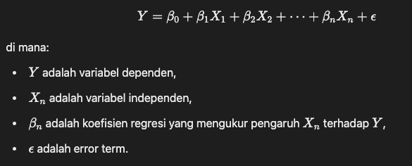

```
Hasil regresi linier menunjukkan bahwa selain USDIDR, variabel makroekonomi lainnya seperti inflasi dan GDP juga memiliki pengaruh signifikan terhadap indikator keuangan tertentu. Sebagai contoh, regresi terhadap ROA menunjukkan bahwa inflasi memiliki pengaruh negatif signifikan (\(p < 0.05\)) dan GDP memiliki pengaruh positif signifikan (\(p < 0.01\)), mengindikasikan bahwa kedua variabel tersebut memengaruhi profitabilitas perusahaan secara berbeda. Hasil serupa diamati untuk indikator lainnya seperti CR dan DER, yang menunjukkan pengaruh yang beragam dari variabel makroekonomi.

Analisis ini memberikan wawasan bahwa kinerja keuangan perusahaan dipengaruhi oleh kombinasi dari berbagai faktor makroekonomi, bukan hanya USDIDR. Untuk menjawab pertanyaan dengan lebih komprehensif, model ekonometrika yang lebih kompleks, seperti analisis regresi panel atau model kausalitas Granger, dapat diterapkan untuk menangkap dinamika hubungan antarvariabel dalam rentang waktu tertentu.

```

# BAGIAN B
Tambahkan data baru, yaitu data kuartal 2 tahun 2024 dan kuartal 3 tahun 2024 (jika sudah ada), dari laporan keuangan masing-masing emiten. Lakukan analisis komparasi kondisi perusahaan (i) tahun 2023 terhadap tahun 2022, dan (ii) tahun 2024 terhadap tahun 2023.

## ROA


## ROE


## GPM


## OPM


## DR


## CR
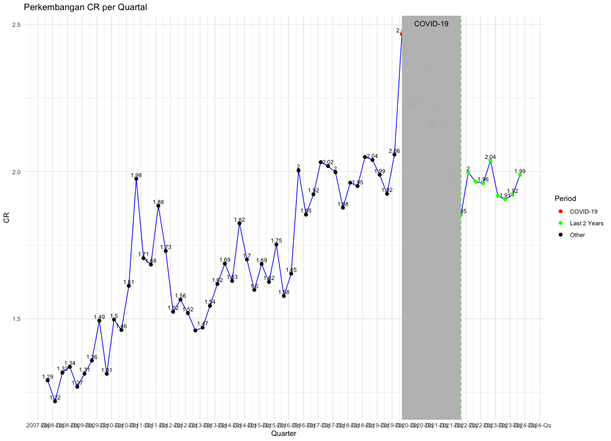
